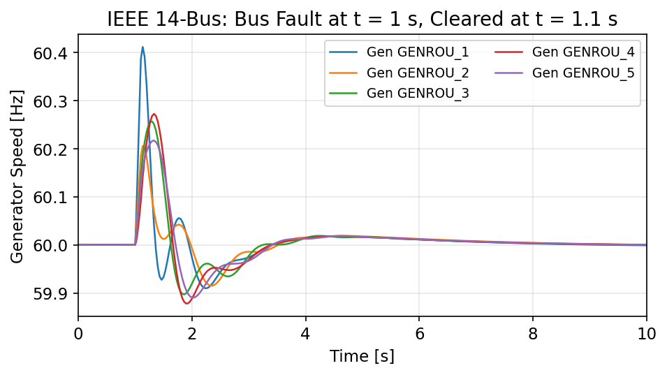
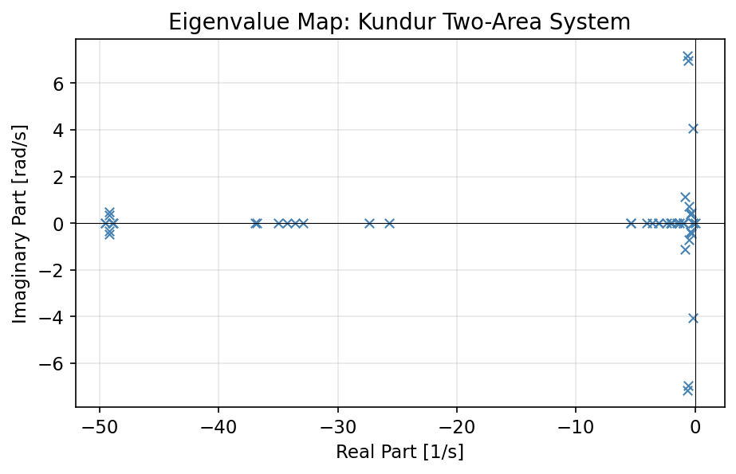
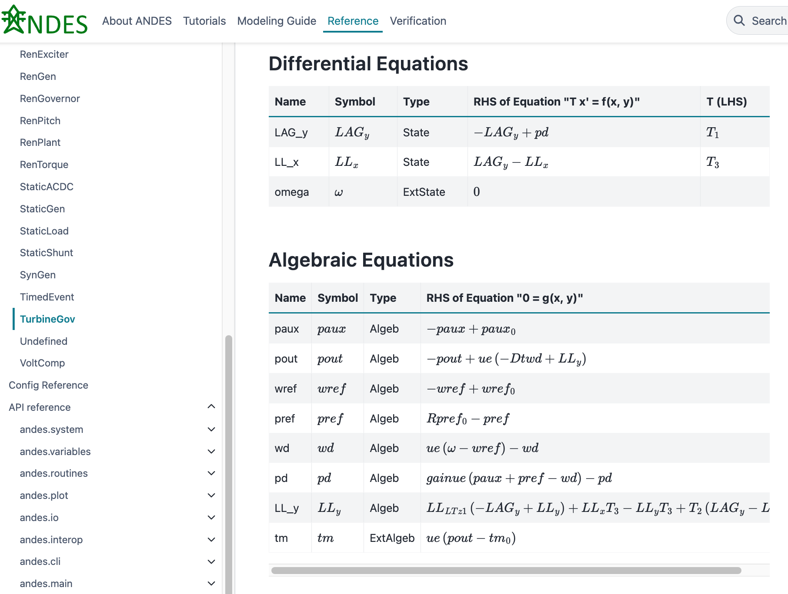

# ANDES

*The dynamic simulation engine of the [CURENT Large-scale Testbed](https://github.com/CURENT)*

[](https://pypi.python.org/pypi/andes)
[](https://anaconda.org/conda-forge/andes)
[](https://andes.readthedocs.io/en/latest/)
[](https://www.gnu.org/licenses/gpl-3.0)

ANDES is an open-source Python package for power system modeling and
simulation. It supports power flow, time-domain simulation (transient
stability), eigenvalue analysis, continuation power flow, and state
estimation.

## Quick Start

```bash
pip install andes       # or: conda install -c conda-forge andes
```

```python
import andes

ss = andes.load("ieee14.raw", addfile="ieee14.dyr", setup=False)
ss.add("Fault", bus=2, tf=1.0, tc=1.1)       # three-phase bus fault
ss.setup()

ss.PFlow.run()                                # power flow
ss.TDS.run()                                  # time-domain simulation
ss.TDS.plt.plot(ss.GENROU.omega)              # plot generator speeds
```

Five lines from a PSS/E case file to a transient stability plot:



## What ANDES Provides

**Five analysis routines.**
Power flow (Newton-Raphson), time-domain simulation (implicit trapezoidal),
eigenvalue analysis, continuation power flow for voltage stability limits,
and state estimation.



**Over 100 dynamic models.**
Synchronous generators (GENROU, GENCLS), turbine governors (TGOV1, IEEEG1,
HYGOV), exciters (EXST1, ESST3A, SEXS, AC8B), stabilizers (IEEEST, ST2CUT),
second-generation renewable models (REGCA1, REECA1, REPCA1, WTDTA1),
distributed energy resources (PVD1, ESD1), and dynamic loads (ZIP, FLoad),
with full implementation of limiters, saturation, and time constant zeroing.

**PSS/E data compatibility.**
ANDES natively reads PSS/E RAW and DYR files, MATPOWER cases, and its own
JSON and Excel formats. Once a dynamic model is implemented, its PSS/E DYR
input is automatically supported.

**Scripting and extensibility.**
Built for Python workflows: load cases, sweep parameters, modify topology,
and extract results in NumPy arrays or Pandas DataFrames. A Gymnasium-compatible
reinforcement learning environment is available for power system control
research.

**Performance.**
A 20-second transient simulation of a 2000-bus system completes in seconds
on a typical desktop computer, with optional Numba JIT compilation.

## Verification

ANDES has been verified against DSATools TSAT and Siemens PSS/E on standard
test systems. The NPCC 140-bus case (GENROU, GENCLS, TGOV1, IEEEX1) produces
results identical to TSAT. The WECC 179-bus case (GENROU, IEEEG1, EXST1,
ESST3A, ESDC2A, IEEEST, ST2CUT) shows close agreement across all three tools.

| NPCC 140-Bus (ANDES vs. TSAT) | WECC 179-Bus (ANDES vs. TSAT vs. PSS/E) |
|-|-|
|  |  |

Full verification notebooks with side-by-side comparisons are available in the
[documentation](https://andes.readthedocs.io/en/latest/verification/index.html).

## Symbolic Modeling Framework

Models in ANDES are defined as mathematical equations in Python. The framework
automatically generates optimized numerical code, analytically derived Jacobian
matrices, and LaTeX documentation from the same source. What you simulate is
what you document.

The following is the complete implementation of the TGOV1 turbine governor.
Reusable transfer function blocks (`LagAntiWindup`, `LeadLag`) and discrete
components (limiters, deadbands) are provided in the ANDES library.

```python
class TGOV1Model(TGBase):
    def __init__(self, system, config):
        TGBase.__init__(self, system, config)

        self.gain = ConstService(v_str='ue/R')

        self.pref = Algeb(v_str='tm0 * R',
                          e_str='pref0 * R - pref')
        self.wd = Algeb(v_str='0',
                        e_str='ue * (omega - wref) - wd')
        self.pd = Algeb(v_str='ue * tm0',
                        e_str='ue*(- wd + pref + paux) * gain - pd')

        self.LAG = LagAntiWindup(u=self.pd, K=1, T=self.T1,
                                 lower=self.VMIN, upper=self.VMAX)
        self.LL = LeadLag(u=self.LAG_y, T1=self.T2, T2=self.T3)

        self.pout.e_str = 'ue * (LL_y - Dt * wd) - pout'
```

ANDES generates documentation from this definition, including parameter
tables, variable listings, and rendered equations:



## Application Gallery

The documentation includes worked examples covering:

- Forced oscillation source localization
- Critical clearing time sweeps
- Low-inertia frequency response analysis
- Reinforcement learning for oscillation damping
- and others ...

Browse the full gallery at
[andes.readthedocs.io](https://andes.readthedocs.io/en/latest/gallery/index.html).

## Resources

- [Documentation](https://andes.readthedocs.io) with step-by-step tutorials,
  a modeling guide, and API reference
- [GitHub Discussions](https://github.com/CURENT/andes/discussions) for questions
- [Issue Tracker](https://github.com/CURENT/andes/issues) for bug reports
- [Examples](https://github.com/CURENT/andes/tree/master/examples)

## Citing ANDES

If you use ANDES for research or consulting, please cite the following paper:

> H. Cui, F. Li and K. Tomsovic, "Hybrid Symbolic-Numeric Framework for Power
> System Modeling and Analysis," *IEEE Transactions on Power Systems*, vol. 36,
> no. 2, pp. 1373-1384, March 2021, doi: 10.1109/TPWRS.2020.3017019.

## Sponsors

ANDES was developed at the
[CURENT Engineering Research Center](https://curent.utk.edu) at the University
of Tennessee, Knoxville, with support from the National Science Foundation
(NSF Award EEC-1041877), the Department of Energy Office of Electricity, and
the CURENT Industry Partnership Program.


See [contributors](https://github.com/CURENT/andes/graphs/contributors) for
the full list.

## License

ANDES is licensed under the [GPL v3 License](./LICENSE).